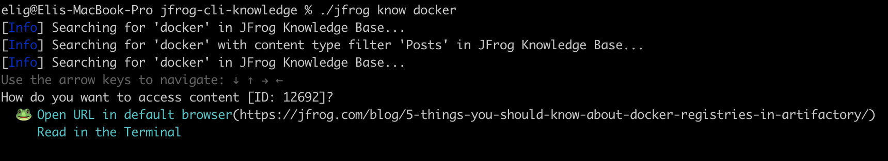

# JFrog CLI Knowledge plugin

Why do we need this plugin? well we are developers and as developers we like command line and shell tools.
In our day to day we often hit issues, problems or simply require to research for more information to progress with our work.
Wouldn't it be great if we could kiss internet browsing goodbye and get everything we need from our beloved CLI tool? 


# Usage

```jfrog know <search query>```

Example:





## Architecture


In our plugin we use a Node Express server to pull Algolia's index content but, it can be easily integrated with Confluence, Jira or any other API-based service. 

The data marshaling can be found in utils/http_kns.go and should be matched to what you return in your kns service.
The CLI has 3 rest calls to the service provider

 1. **Get facets list** (/api/v1/search/facets?query={searchQuery}) will return the Content results options.
 2. **Get Results list per facet** (/api/v1/search?query={queryString}&facet={facetName}) Will return the list of results.
 3. **Get Post per ID** (/api/v1/search/id/{postId}) Will return the actual content and metadata of the post
	 
All the CLI communication function with the KNS service can be found in the **commands/knowledge.go** and can be altered if needed. 	 

## How to build
### CLI
    go build -o jfrog
### KNS node services

    docker-compose -f docker/docker-compose.build.yaml build

 You will need to pass ALGOLIA_APPID , ALGOLIA_APIKEY, PORT as ENV for the container to run, by default it will use our service https://knscli.jfrog.org/api/v1/search/ping

